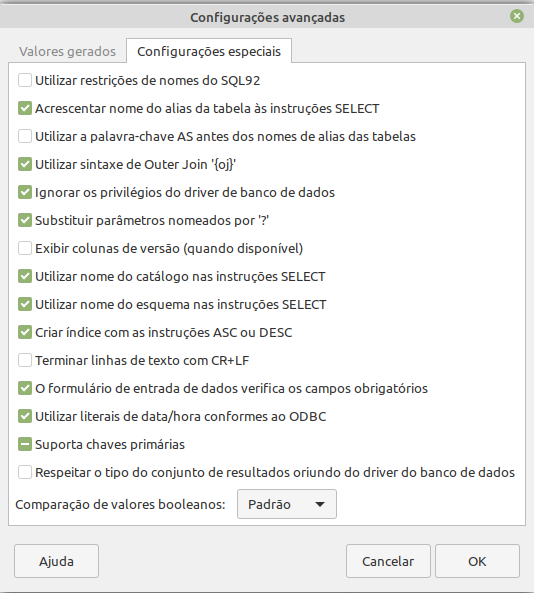

# Criar aplicativo com LibreOffice Base e PostgreSQL

## Criei o banco cadastro e importei o script

https://raw.githubusercontent.com/ribafs/aplicativos-sem-codigo/main/db_pg.sql

## Baixei

https://jdbc.postgresql.org/download/postgresql-42.2.20.jar

Copiei para a mesma pasta em que está o do mariadb

E adicionei ao LibreOffice como fiz com o MariaDB, de acordo com

https://ribafs.medium.com/criando-aplicativos-sem-c%C3%B3digo-6a9cc69301f6

## Criar o Aplicativo com o tipo JDBC

jdbc: 

postgresql://localhost:5432/cadastro

ClassPath

org.postgresql.Driver

Nome do aplicativo cadastroLOBasePg

## Configurações Avançadas

- Estando na janela do Base
- Editar - Configurações Avançadas
- Adicionei: Acrescentar nome do alias ... e Substituir parametros nomeados por '?'

PostgreSQL: the connections could be set in
Edit > Databases > Advanced Settings
You have to switch named Parameter to '?'.

Referência

https://medium.com/@rmaziere/how-to-connect-libre-office-base-to-a-postgresql-database-34530027ec46

https://boringnerdystuff.wordpress.com/2012/02/15/connecting-to-postgresql-with-libreoffice-base/

https://ask.libreoffice.org/en/question/226234/base-cannot-use-tables-from-postgres-12/

https://bugs.documentfoundation.org/show_bug.cgi?id=119569
